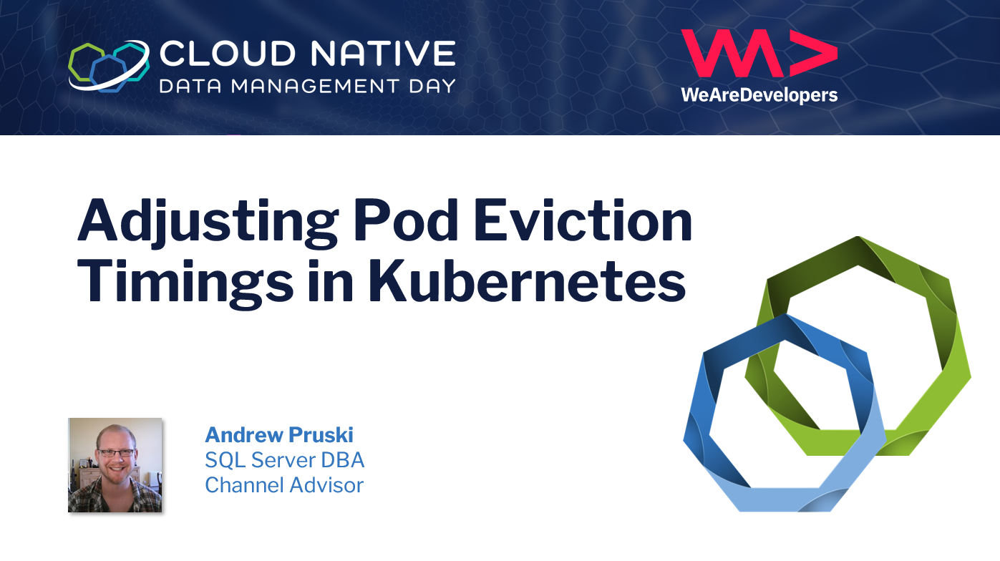
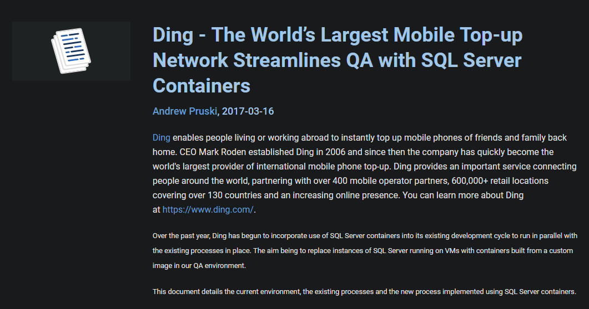

## Adjusting Pod Eviction Timings in Kubernetes

---

---

## Andrew Pruski

### SQL Server DBA, Microsoft Data Platform MVP, & Certified Kubernetes Administrator
<!-- .slide: style="text-align: left;"> -->
<i class="fab fa-twitter"></i><a href="https://twitter.com/dbafromthecold">  @dbafromthecold</a> 
<i class="fas fa-envelope"></i>  dbafromthecold@gmail.com 
<i class="fab fa-wordpress"></i>  www.dbafromthecold.com 
<i class="fab fa-github"></i><a href="https://github.com/dbafromthecold">  github.com/dbafromthecold</a>

---

## Background

<!-- .slide: style="text-align: left;"> -->
<ul>
<li class="fragment">SQL Server DBA for over 10 years </li>
<li class="fragment">Running SQL Server in containers for dev/test/qa </li>
<li class="fragment">Can I run SQL Server in a container in production?</li>
<li class="fragment">Started to investigate running in Kubernetes</li>
<ul>

---

## Using SQL Server in Containers

<!-- .slide: style="text-align: left;"> -->

<a href="https://www.sqlservercentral.com/articles/ding-the-world%E2%80%99s-largest-mobile-top-up-network-streamlines-qa-with-sql-server-containers">Source</a> 

---

## Pod Eviction on Node failure

<!-- .slide: style="text-align: left;"> -->
<ul>
<li class="fragment">What happens when a node fails? </li>
<li class="fragment">Aka a node becomes "NotReady" </li>
<li class="fragment">Pods are moved to node in the "Ready" state</li>
<li class="fragment">However, by default this takes 5 minutes</li>
<ul>

---

# Demo

---

### Setting eviction timeout on the api-server
<!-- .slide: style="text-align: left;"> -->
<pre><code data-line-numbers="1-8|7-8">apiVersion: kubeadm.k8s.io/v1beta2
kind: ClusterConfiguration
kubernetesVersion: v1.18.0
apiServer:
  extraArgs:
    enable-admission-plugins: DefaultTolerationSeconds
    default-not-ready-toleration-seconds: "10"
    default-unreachable-toleration-seconds: "10"
</pre></code>

 

<pre><code>sudo kubeadm init phase control-plane apiserver \
--config=kubeadm-apiserver-update.yaml
</pre></code>

---

## Adding tolerations to deployments
<!-- .slide: style="text-align: left;"> -->
<pre><code data-line-numbers="1-5|5|6-9|9">tolerations:
- key: "node.kubernetes.io/unreachable"
  operator: "Exists"
  effect: "NoExecute"
  tolerationSeconds: 10
- key: "node.kubernetes.io/not-ready"
  operator: "Exists"
  effect: "NoExecute"
  tolerationSeconds: 10
</pre></code>

---

# Demo

---

## What about stateful applications?

<!-- .slide: style="text-align: left;"> -->
<ul>
<li class="fragment">Pods need to move to a new node </li>
<li class="fragment">Storage also has to move</li>
<li class="fragment">Otherwise the pod will not spin up</li>
<ul>

---

# Demo

---

## Resources

<!-- .slide: style="text-align: left;"> -->

<a href="https://github.com/dbafromthecold/KubernetesPodEviction">Github Repo - Kubernetes Pod Eviction</a> 
<a href="https://dbafromthecold.com/2020/04/08/adjusting-pod-eviction-time-in-kubernetes/">Blog Post - Adjusting pod eviction time</a> 
<a href="https://kubernetes.io/docs/concepts/scheduling-eviction/taint-and-toleration/">Kubernetes Documentation - Taints and tolerations</a>

